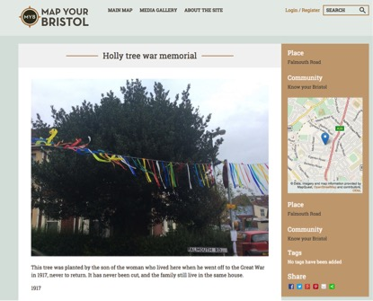

## Silent Witness ##

We took the History bus out for its first run on a pleasant day in September in north Bristol. It was the day of the Falmouth road street party (you want a street party? Come here, it’s a Bristol thing). The bus – we still call it that, but it’s a lorry that expands – blocked off one end of the road, which is tucked away between the vibrancy of Gloucester road and the quieter walls of Bristol prison. 

There was bunting; the street was chalked; there was a barbeque. We were intruders really, but warmly welcomed, and everybody made a point of coming along to nose around: it’s not often a history bus parks on your street. Inside we set out old maps, copies of the census entries for the street, books of old photographs of Bristol from the Reece Winstone collection, and tablets, laptops and phones all equipped with our Map Your Bristol platform. Here’s the 1900 map, and 1870s: look, the street’s not here that early; see how you can add information to it. We were in testing mode, eager to get people to poke and prod. In came young children, all freshly face-painted, and older residents whose families had lived in the street for a century or more. 

What could they find, what could they tell? (We had voice recorders ready) Look who was in my house they said, looking at the 1911 census; what does this mean; see where they came from; oh, I remember that family name. On our partner Know Your Place site we could call up the 1946 aerial map of the city, showing how the houses just yards from the steps of the bus had been bombed out during the devastating Bristol blitz. The children dashed between the door of the bus and the laptops, working out which of the houses it was that had been hit. Then they thought about what that actually meant.

Discreetly, further past the former bomb-site was a house with an over-grown holly tree in its tiny front garden. Shall I tell you about that tree, one long-term resident said to a more recent arrival. I listened in. Shall I tell you why it’s not pruned and why it’s so large? Well, she said, in 1917 the lad living in the house went to the war. As he departed, he planted a small holly cutting in the front. He was one of the ten per cent who never returned. So that tree became their war memorial, and as a result was never cut: and the family still live there, another generation now.

People move, and yet they don’t. Millions travel overseas every year for holidays, and ten per cent of British passport holders live permanently abroad. We are so used to thinking of change and churn that it’s easy to forget how stable and sometimes static we are as well. Sometimes it takes a bus, a bunting-lined street, a tree and a neighbour to tell us, and to fill in a bit of the city’s untold history. You won’t find this on a list of monuments, but it’s as much part of the texture of the city as the otherwise more visible memorials carved from stone.

Falmouth Road’s holly tree, otherwise unmarked, largely unnoticed, was then photographed and the image and a brief description were loaded into the platform. The house is now on the market for the first time in its history; so the memorial has an uncertain future. In our final report it will be yet one more data point amongst several thousand, mapping our Bristol, but it’s something more tangible now, a story otherwise hidden, now shared across generations like others that morning, a very poignant one, lingering in the air as the day unfolded around it.

Robert Bickers, Know Your Bristol On The Move
http://knowyourbristol.org/
http://www.mapyourbristol.org.uk/ 
http://www.bristol.gov.uk/page/planning-and-building-regulations/know-your-place 

Research team (all University of Bristol, unless otherwise noted): Chloe Anderson, Robert Bickers, Tim Cole, Tash Dummelow (Calling the Shots (CTS)), Nate Eisenstadt, Penny Evans (Knowle West Media Centre), Mike Gulliver, Pete Insole (Bristol City Council), Josie McLellan, Kate Miller, Nick Nourse, Angela Piccini, Jeremy Routledge (CTS), Rob Skinner, Paul Smith, Marcel Thomas, Julian Warren (Bristol Record Office), Justin Williams, Mike Williams, and not forgetting Steve Gear (CTS) and Peter Lewis (London Met), artists in residence David Hopkinson and Zoe Tissandier, and collaborators, friends and volunteers at ACTSA, Knowle West, SPAN and across the city of Bristol

_image: www.mapyourbristol.org.uk_
