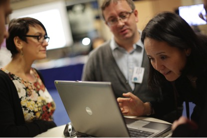

#Big UK Domain Data for the Arts and Humanities#

The web is an integral part of our daily lives, whether we are shopping online, booking cinema tickets, registering to vote or checking the weather. It is also of enormous importance to arts and humanities researchers, as the site of digitised historical material, as a primary source in its own right, and as a means of promoting and communicating research to the widest possible audience. It is hard to imagine how you would write the history of the late 20th and early 21st centuries without access to all of this data. Where once we had handwritten diaries, we now have blogs; letters are superseded by Facebook status updates; and carefully managed Flickr collections have taken the place of photo albums.

But the web is inherently impermanent. Whole sites may disappear, and even those which remain are subject – to varying degrees – to change over time. Consequently, the archiving of this vast range of material is increasingly occupying national memory institutions such as the British Library and The National Archives. This is a huge undertaking. The historical dataset with which this project was chiefly concerned covered the period 1996–2013, some 65 terabytes. The first full UK domain crawl begun in April 2013 took almost eleven weeks to complete, resulted in the harvesting of 1.9 billion URLs (a web page, image or similar) and amounted to 31 terabytes. This full crawl will be undertaken at least once a year, generating the big data that humanities researchers cannot afford to ignore.

Dealing even with structured data on this scale is not easy, but web archives offer unique challenges for researchers. Bluntly the data is messy, collected irregularly to varying degrees of completeness, and as it grows will contain multiple duplicates of some web pages. The depth of collection is uneven: some important sites are crawled in their entirety, others to only a shallower level. Different media within a page may not be acquired successfully, so that only partial content is preserved – and so on. As things stand, we have neither the expertise nor the tools to exploit this invaluable resource reflectively.

The Big UK Domain Data for the Arts and Humanities project aimed both to develop a theoretical and methodological framework within which to study this data and to engage scholars in the co-design of new analytical tools. Ten researchers, from a variety of arts and humanities disciplines, were awarded bursaries to work with developers at the British Library, under the guidance of the project team. Their proposals ranged from analysing Euro-scepticism on the web to studying the Ministry of Defence’s recruitment strategy, from examining the history of disability campaigning groups and charities online to looking at Beat literature in the contemporary imagination. The case studies that they have produced demonstrate some of the challenges posed by the archived web, but also its value and significance.

The project has resulted not only in one of the largest full-text indexes of web archive (WARC) files in the world, but also a sophisticated interface which supports complex query building and gives researchers the ability to create and manipulate corpora derived from the larger dataset. It is no longer necessary to know the URL of a now-vanished website in order to recover an archival copy. The tools and knowledge developed during the project have already influenced provision of and access to web archives at the British Library, and the software and processes have informed similar work in Denmark and Canada. We are beginning to transform how we interact with this essential part of our digital cultural heritage.

Research team: Institute of Historical Research, University of London: Jane Winters, Jonathan Blaney; The British Library: Helen Hockx-Yu, Andrew Jackson, Peter Webster, Kinman Li, Gil Hoggarth, Jason Webber; Oxford Internet Institute, University of Oxford: Eric Meyer, Ralph Schroeder, Josh Cowls, Scott Hale, Jonathan Bright, Grant Blank, Taha Yasseri; Aarhus University: Niels Brügger. 

_Image: Researchers from Big UK Domain Data for the Arts and Humanities show material from the web archive_

[back](./)