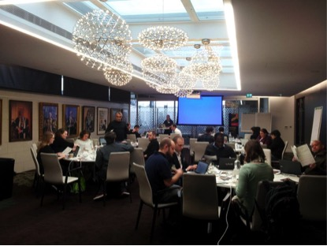

#Visualising European Crime Fiction#

_Workshop organized by the Visualising European Crime Fiction project_

_Visualising European Crime Fiction_, was led by Dr Dominique Jeannerod (School of Modern Languages and ICRH, Queen’s University, Belfast) and involved a network of scholars participating in the International Crime Fiction research group and the Popular Literature and Media Studies Association. Examining the history of transnational circulation of popular culture across the continent, the project intended to test for the first time within this specific field the use of digital technologies for the collection, analysis and visualisation of bibliographical metadata. The support from the AHRC was instrumental to address three key aspects of the research: its international dimension; the importance of collaborating with non-academic partners; and the need to acquire the new skills required by a Digital Humanities project.

Firstly, the AHRC funding helped to reinforce the existing connections between the core group of researchers. Scholars from the UK, France and Hungary were able to meet regularly for a series of public events and workshops in the three countries, sharing their different methodologies and their knowledge of their respective cultural and linguistic contexts. Equally important was the broadening of the international scope of the project: the conferences held in different parts of Europe attracted new collaborators from Germany, Greece, Sweden, Finland, the Czech Republic and Romania, who all became regular contributors. New contacts with various American institutions (including George Mason University, which developed some of the key tools used in the project) were also established with the goal of working together on future bids.

Secondly, the AHRC support facilitated cooperation with non-academic partners, chiefly with institutions engaged in the preservation of popular fiction. The Director and the staff of the Parisian _Bibliothèque des Littératures Policières_ (BILIPO), the only library in the world entirely devoted to crime-themed publications, shared generously shared their data, images, ephemera and critical materials. The passion of the BILIPO staff did not only supply the project with a huge amount of information, but also with an insider’s view of the functioning of this kind of special collection. In particular, this collaboration allowed a greater understanding of the historical and theoretical issues concerning the archiving and cataloguing of popular fiction, and helped to rethink them in light of the new digital environment. Equally crucial was the partnership, developed only in the course of the project, with the British Library. Librarians and digital scholars at the BL provided their data and expertise, and co- organised a symposium and two workshops in London, also in connection with events such as the Data Curation Conference and the British Library Labs THAT Camp. These initiatives offered exciting opportunities to exchange data, skills and digital competences with other literary scholars, librarians, data curators and experts in data visualisation. The partnership with the private IT company, Pixight (Limoges) led to the delivery of a group of plugins for the open-source software Omeka to be freely distributed to its worldwide community of users.

Finally, the long and complex process of learning how to use new technology to collect and handle bibliographic metadata, and then turn it into meaningful visualisations was possible thanks to the collaboration between literary scholars and a number of experienced Digital Humanists, specialists in digital mapping, web and graphic designers, and data scientists from different universities and countries. The results of the effort put into transcending the boundaries between disciplines, methodologies and technologies gave the core group of Co-Investigators the most durable of the project’s outcomes. All future initiatives launched by the International Crime Fiction research group and the Popular Literature and Media Culture association will greatly benefit from the ground-breaking experiment in overcoming the geographical, cultural and technical issues that are to be expected when implementing these types of international, comparative and digitally-enhanced projects.

For more information on the project and the research group’s activities: http://internationalcrimefiction.org/

Research team: Queen's University Belfast: Dominique Jeannerod, Federico Pagello, Andrew Pepper; University of Limoges: Loïc Artiaga, Natacha Levet; University Debrecen: Sandor Kalai, Anna Keszeg; BILIPO, Paris, Catherine Chauchard, Samuel Schwiegelhofer, Alain Regnault; University of Limoges Geomaticians : Rémy Crouzevialle and Fabien Cerbelaud; Société Pixight, Limoges
