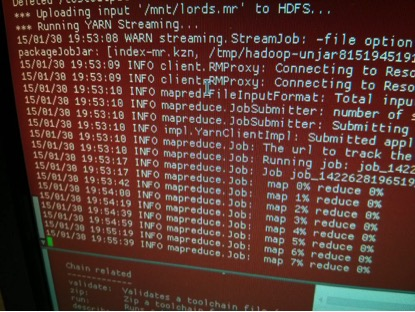

#The SAMUELS project#

Words are at the heart of our use of digital resources; we access and arrange information by searching for words, tagging information with key words, or browsing by topic or heading words. However, as users increase and data become bigger and more complex, it is necessary to face the key truth that words are inefficient and ineffective for all of these purposes. Over 62% of English word forms refer to more than one meaning (67 word forms in English have more than 100 possible meanings, 2,580 have more than twenty possible meanings, and 111,127 have more than one possible meaning); a user searching for the word ‘strike’ will know just what meaning they have in mind, but to a computer all 276 meanings are equal, from a disease of sheep and cattle, the creation of coinage, the act of hitting a person or thing, a political cessation of work, the sinking-in of a dye, a clock chiming, a snake attacking, or the fortune of digging into a seam of oil, coal, or luck. As searching is an essential part of effectively using information such as digitized books, internet news, email archives, online manuals, and social media content, this problem harms business and the general public just as much as academia; analysis of textual data allows companies to finesse their business strategies, general internet users to find the information they require more rapidly, and researchers to identify patterns in datasets too large to be ‘read’ by a human researcher. The time taken by combing through pages and pages of search results is inefficient in the extreme; in the House of Commons since 1803, the word form *strike* has been used 68,553 times, and of these 39,298 refer to a work stoppage, 18,295 to a physical blow (often metaphorical), and 294 to *striking off* items from a list, among many others. The time people have spent hunting through these lists of results for those they want is an almost incalculable waste.

In place of using these word forms, therefore, the SAMUELS project (the acronym stands for Semantic Annotation and Mark Up for Enhancing Lexical Searches) provides a key development in tackling the issue of search difficulty is the development of a capability to run semantic searches, in which the meanings of words are primary. SAMUELS produced the Historical Thesaurus Semantic Tagger (HTST), a freely-available resource which allows each word in a text to be tagged with its disambiguated meaning. The meaning codes come from the _Historical Thesaurus of English_, a world-leading resource which took fifty years to create at the University of Glasgow, and which takes every word known to exist in the last 1,300 years and arranges them according to their meanings. Each of these meanings is nested within other, wider categories, so that - for example - the verb category *Live dissolutely* is within *Licentiousness*, itself adjacent to *Guilt* and *Rascalry* and within the wider category of *Morality*. Meanings can range from the very generic (*Finance*, *Regions of the Earth*, *Having/Possession*) to the highly specific (*the spurious contents of a ship’s papers, to arrange bricks in a kiln, pertaining to Rousseauism as a theory of natural philosophy*).

With the SAMUELS HTST, it is therefore now possible to search, for example, 200 years of Hansard for meanings, not words – such as *strike* in the area of political labour relations, or in the sense of an *air strike* – and so getting results based on a speaker’s discussions of concepts rather than choosing a likely word or two to search for and then combing through the results for the intended documents. It is a project only possible by the combination of expertise in words and meaning from the _Historical Thesaurus_ team alongside historians, text analysts, and computer experts.

Research team: University of Glasgow: Marc Alexander, Christian Kay, Brian Aitken, Fraser Dallachy; Lancaster University: Alistair Baron, Paul Rayson, Scott Piao, Stephen Wattam; University of Central Lancashire: Dawn Archer, Bethan Malory; University of Strathclyde: Jonathan Hope; University of Huddersfield: Lesley Jeffries, Brian Walker, Jane Demmen.

_Image: Indexing of Hansard using the 112-core Hadoop cluster at Lancaster University for the SAMUELS project_
