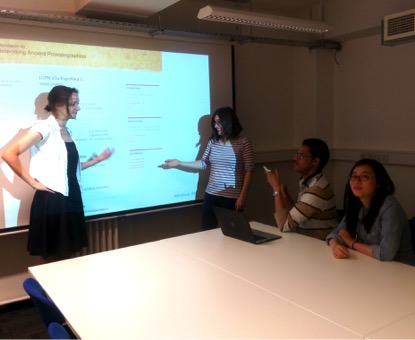

#Networking Ancient People - Engaging New Researchers#

The SNAP:DRGN project (Standards for Networking Ancient Prosopography: Data and Relations in Greco-Roman Names, hereafter “SNAP”) was funded under the Big Data programme of the AHRC’s Digital Transformations theme in 2014. In the first pilot year of the project, we produced a robust set of recommendations for sharing person data between the many large datasets containing information about historical/mythical persons and person-like entities such as families, groups, deities or monsters (*http://snapdrgn.net/cookbook*). We also tested these standards against a moderate body of data in the form of three core datasets and two library person catalogues, using Linked Open Data in the form of an RDF triplestore. The web interface for these resources was still somewhat lacking, not having been high on our priorities until the data was ready.

In spring term 2015, a group of students from the MA Digital Humanities at King’s College London expressed an interest in gaining some research experience on the SNAP project. A few of these worked as part of a formal internship module, but most were volunteers who wanted to improve their coding skills, gain project management experience, and consolidate what they had learned about digital humanities in their study. As tutors as well as members of the SNAP research team, we considered this process as important for pedagogical value to the students as any improvement to the tools and process they might provide. There have been significant benefits on both sides.

The students organized themselves according to their interests and priorities, using a Github repository, and we populated the issue tracker with 28 microtasks, roughly grouped under the following headings:

1.	**Project management and communication**: especially of interest to students interested in cultural heritage institutions and digital communication.
2.	**Workflow and data improvement coding**: using python and SPARQL; the main achievement so far has been the implementation of a ‘merging script’ that takes information about person co-references between datasets and creates RDF statements linking the records together.
3.	**Population of person pages on web**: the largest task, made up of 14 sub-tasks, involving the use of SPARQL queries on the SNAP triplestore to gather relevant person-data, and a python/django interface to send this information as variables to a HTML template.
4.	**Scripting of search and index API**: Building on the previous task, this would involve creating pages to allow discovery of persons by various criteria (identifiers, names, epithets).
5.	**Web design and user experience**: a side-project carried out by two placement students from UCL, which improved the look and feel and usability of the site.
6.	**New prosopographical data creation**: not strictly related to SNAP, two visiting Erasmus interns from Thessaloniki and one of our interns worked on the creation of XML person data from various sources, both by hand and automated via web-scraping.
7.	**Prosopographical data to HTML and RDF**: using XSLT, one of our students wrote a process to create (a) web pages and (b) SNAP-compliant RDF from the XML in the above task.
8.	**Ontology development**: Improvements to the SNAP ontology and graph visualization using the OWL and Protégé tools.

The students reported that they particularly enjoyed the sense of contributing in small ways while fitting into the bigger picture, and benefited from the experience of teamwork and of learning from one another. They regarded the skills they acquired as transferable, and most importantly as complementary to the techniques they were taught in the elementary python and structured data modules in the MA. They have also contributed useful code to the SNAP project code base, and will all receive a co-author credit on the open source software released by the project.

Research team: King’s College London: Gabriel Bodard, K. Faith Lawrence; University of Southampton: Leif Isaksen; University of Oxford: Sebastian Rahtz; Duke University: Hugh Cayless; KU Leuven: Mark Depauw. With thanks to Francesca Giovanetti, Ethan Jean-Marie, Emma King, Argula Rublack and Katherine Ying

_Image: Student volunteers from King’s College London discuss the design of the website for the SNAP:DRGN project_
