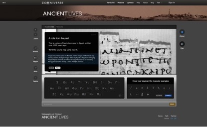

#Proteus: Capturing the Big Data Problem of Ancient Literary Projects#

The hugely successful Ancient Lives website, a crowd-sourced collaborative online project dealing with the archive of Greek papyri from Oxyrhynchus, which has had tremendous public impact over the past two years, has generated a massive database - over 1.5 million transcriptions of the Oxyrhynchus papyri (over 7 million characters), the work of over 250,00 online collaborators. These include literary, sub-literary and documentary texts. To handle this mass of data with maximum efficiency we are building Proteus, a system comprising of both an innovative digital editing and research tool for scholars working on unpublished papyri and a larger web portal devoted to literary and subliterary fragments (sub-classified for history, biography, and so on). We aim to produce a single on-screen interface to enable comparison between original and edited versions of literary and subliterary texts, and establish an online system that facilitates collaboration between scholars in the editorial process. *Proteus*' editing tool will change the way papyrologists and editors work, while its web portal, accessible to the world, will both instigate further research and provide an intelligent means of interfacing the conjectures and variant readings that these fragments generate as they are re-edited over time. Whilst constructing this tool, we will also produce a critical edition of Servius' commentary on Vergil Aeneid VI, serving as a prototype for subsequent digital critical editions of his commentary on other books of the epic. This prototype will offer a framework for creating digital editions of ancient commentaries in general, whose complex formatting require innovative ways of digital reading, something beyond the codex experience.

Research team: University of Oxford: Dirk Obbink, James Brusuelas

_Image: The web interface of the very successful project for crowdsourcing transcription of papyri, Ancient Lives: www.ancientlives.org_
