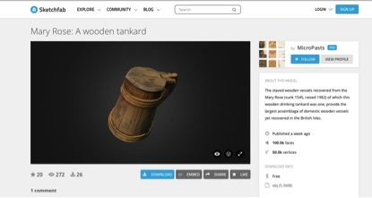
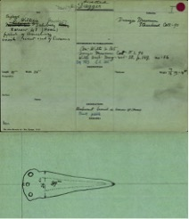
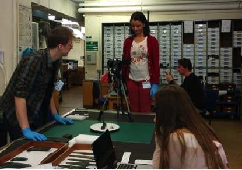

#MicroPasts: Crowd- and Community-Fuelled Archaeological Research#

_MicroPasts_ (_micropasts.org_) is a web platform that brings together full-time academic researchers, volunteer archaeological and historical societies and other interested members of the public to collaborate on new kinds of research about archaeology, history and heritage. It is a place where enthusiasts (of any background) can not only create high-quality research data together, but also collaboratively design and fund entirely new research projects. In particular, we want to improve how people traditionally distinguished as ‘academics’, ‘professionals’ and ‘volunteers’ cooperate with one another (as well as with other people out there who as yet have no more than a passing interest).

Through _MicroPasts_, we will develop and support a range of online crowd-sourcing and crowd-funding projects about our human history. By joining in, you can help research, fund and/or design as many projects as you like, with as much or as little personal commitment as you wish. Some existing projects are about creating 3D models of archaeological artefacts, enriching old photographic archives, or transcribing old archaeological or historical records, to name just a few that we have come up with so far. Other new projects will need your help with financing before they can begin, whilst yet others might be collaborative research topics that you might want to propose yourself (as an individual, as part of an organised society or in tandem with other interested people that you meet online). 

We cannot yet say which projects will prove popular and which ones will not, and we hope that many as yet unanticipated agendas will be dreamt up collectively. In any case, we are keen for your ideas and your contributions wherever we can get them.

In a more technical sense, _MicroPasts_ supports (a) modular applications for massive online data collection about archaeology, history and heritage, as well as (b) a micro-funding model for supporting new (not-for-profit) research projects where collaboration between academic institutions and volunteers is a key feature. The software used to build the platform is entirely free and open source, and the data we create is also required to be open-licensed and publicly available.

To give an idea of the range of projects already supported by _MicroPasts_, here are descriptions of two current projects from the _MicroPasts_ blog:

In the process of digitising the British Museum’s Bronze Age Index (*http://crowdsourced.micropasts.org/app/devizes/newtask*), the project came across a small collection of index cards recording artefacts in the Wiltshire Museum (formerly the Devizes Museum: *http://www.wiltshiremuseum.org.uk/*). These cards illustrate over 100 bronze objects found largely during eighteenth- and nineteenth-century antiquarian investigations of various barrow groups in the regions surrounding the monumental landscapes of Stonehenge and Avebury. These include some of the famous barrow cemeteries found in Salisbury Plain, such as the Lake Down Group, Normanton Group (Bush Barrow), and Amesbury Curses. While some of these cards are now out of date information, they do offer us an excellent picture of the early antiquarian discoveries found in the region over 200 years ago, especially those of William Cunnington and Sir Richard Colt Hoare.  Many of these sites would have never been recorded if not for their hard work! Further collaboration with the Wiltshire Museum, and the integration of the digital resources available via their collection portal (*http://www.wiltshireheritagecollections.org.uk/*) will allow us to update and expand our records as we continue to expand our research. This information will eventually be integrated into the Portable Antiquities Scheme (*finds.org*) database, making it one of the largest records of prehistoric objects in the UK and the world.

In May 2015, the Mary Rose Trust and _MicroPasts_ teams launched a collaborative 3D photo-masking pilot project on the _MicroPasts_ crowdsourcing platform. The aim is to create 3D models for three of the museum’s artefacts. The Mary Rose was a Tudor warship that sank during a battle with an invading French fleet near Portsmouth in 1545. The hull and her contents were covered (and preserved) by the silts of the Solent. They remained there until they were rediscovered in 1971. Following one of the largest maritime excavations ever undertaken, the hull was eventually raised on 11 October 1982. In May 2013 a new purpose built museum, that reunited the hull and thousands of her artefacts, was opened to the public. The current _MicroPasts_ 3D photo-masking pilot project is based around three of the artefacts that can be seen on display in the museum. These are: a beautiful bone plaque showing two angels, probably made in northern Italy; a staved wooden tankard; and a beech wooden bowl. 

Research team: Institute of Archaeology, UCL: Andrew Bevan, Chiara Bonacchi, Ad Keinan-Schoonbaert; British Museum: Daniel Pett

_Image1: 3D visualisation of a tankard from the Mary Rose, from the MicroPasts Sketchfab page_

_Image2: British Museum index card for a dagger from a barrow found inside the west end of Stonehenge Cursus, among those digitized by the MicroPasts project_

_Image3: The MicroPasts team taking photos of a British Museum hoard, in preparation for a photo-masking crowdsourcing application_
