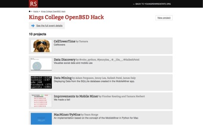

#Our Data, Ourselves#

The process by which the use and measurement of computerised data is transforming many aspects of our lives and creating new types of value has been described as ‘datafication’. The project _Our Data, Ourselves_ (ODO) (*http://big-social-data.net/*) investigated the increasing datafication of youth cultures in mobile environments and developed a social data commons where participants could share their datafied cultural expressions for research purposes. Until now, access to mobile data has been restricted to a handful of companies and government agencies. With our work, we hope to contribute to the democratisation of this information and open up exciting new avenues of research and creativity for both the academic community and the general public. For researchers in the humanities, understanding datafication will be a key to decoding the human condition in the future. Our project has concentrated on mobile environments but there are many more examples on how born-digital archives will allow us to develop much more comprehensive and also evidence-based views on the human condition.

In order to make such projects work, trust and ethical data mining need to be developed. From the beginning, we collaborated closely with Young Rewired State (YRS), a global community of digital makers aged eighteen and under (*http://www.yrs.io/*) in order to co-develop in hackathons the ODO research environment. The members of YRS were given opportunities to experiment with new technologies, software and computer languages while being actively encouraged to turn their ideas into real prototypes at different hackathons. Our interest in working with these young people stemmed mainly from the rich computer literacies that they already possessed, which enabled us to learn from them via their active participation. By using project-focused learning, young people worked in groups to improve their skills, sharing and working with both peers and mentors. In short, this co-research method depended upon the technically informed agency of our participants in negotiating their data-rich mobile environments. Thus, we expected them to both access and analyse the data they were generating not only via the harvesting MobileMiner app but through their collective construction of tools that might impact upon their peer groups who do not have the same technological expertise.  

This jointly developed ODO environment included a mobile app called MobileMiner (*https://github.com/kingsBSD/MobileMiner*) that tracks in- and out-going communications in mobile devices. The communication data is synced periodically with the social data commons allowing YRS hackers as well as King’s researchers to analyse and experiment with it. In several controlled experiments, participants from YRS were given mobile phones with the Mobile Miner app to track their mobile communications over certain periods of time. We are now working with the Open Data Institute (*http://opendatainstitute.org/*) to investigate alternatives that provide even wider access to the data, which is technically and socially more complicated, as it requires new thinking on how to anonymise data to make certain that it cannot be misused. Reliable anonymisation and the corresponding ethical and legal frameworks remain the big obstacles for this kind of research on datafied cultural expressions.

The collaboration with the young coders from YRS as the one of the most stimulating parts of our work. Our YRS co-researchers produced creative and innovative approaches to understanding and dealing with the data leaked by mobile environments. They developed with us the range of tools we have been using to analyse mobile communications and created their own perspective to how to analyse it. For instance, one participant created what he referred to as ‘sous-surveillance’ of the apps he was using. He saw the hack as an opportunity to try and break down the more opaque and complicated sets of relations that obfuscate personal data collection. His goal was to sonify the usage or ‘attention grabbing-ness of apps in a way that could be applied so you could tell immediately which [apps are] worse for calling home.’ As data is transmitted more frequently between the user and the app, the sounds produced become more and more invasive.

Research team: King’s College London: Tobias Blanke, Mark Coté, Jennifer Pybus, Giles Greenway; Young Rewired State.

_Image: List of some of the projects developed by young coders from Young Rewired State in the first hackathon held by Our Data, Ourselves: http://hacks.youngrewiredstate.org/events/Kings%20College_
