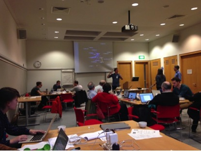

#A Big Data History of Music#

_Image: Marnix van Berchum, from the Netherlands Data Archiving and Networked Services, displaying his visualisation of the relationships between Venetian music printers in the 16th century_

Music historians can now see their topic in broader perspectives, thanks to a collaboration between Royal Holloway and the British Library. The project _A Big Data History of Music_ has analysed large bibliographical datasets to show how the publishing and dissemination of music was shaped by factors such as war, disease, religious change, and rising nationalism. 

By analysing data for the production of printed music throughout the 17th century, the project showed how plague in Venice in 1630/31 triggered a devastating drop in the printing of music across Europe. Scrutinising the titles of hundreds of thousands of items of printed music in 19th-century Britain, the project showed how English musicians produced pieces with ‘Scottish’ flavours in response to the strengthening political and economic union between the two countries. Through such data-driven enquiries, music history becomes far more than the study of the works of famous composers such as Bach, Beethoven and Brahms. Instead the project opens new avenues for research, showing music’s symbiotic relationship with long-term social and economic trends. 

The project cleaned and analysed some of the world’s biggest datasets about printed and handwritten music. As a result of these efforts at data cleaning, the British Library’s catalogue of printed music—containing over a million bibliographic records describing music from 1500 to the present day—has been made available as an open dataset for analysis and repurposing (*www.bl.uk/bibliographic/download.html*). The project also analysed datasets assembled by Répertoire International des Sources Musicales (RISM), the organisation that locates and documents musical sources from across the globe. 

_A Big Data History of Music_ concluded with two public events at the British Library, on 10th and 11th March 2015, at which an international contingent of over ninety musicians, curators, software developers, students and researchers experimented with the project datasets. Workshops and training sessions were offered for users new to data analysis within the humanities, while experienced users were free to develop their own visualisations of the project’s datasets.

Research team: Royal Holloway, University of London: Stephen Rose, Loukla Drospoulou; British Library: Sandra Tuppen
