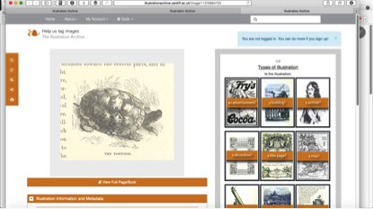

---
The Illustration Archive
---

#The Illustration Archive#

The Lost Visions project led to the creation of the world’s largest online searchable archive of book illustration: _The Illustration Archive_ (illustrationarchive.cardiff.ac.uk). The archive contains over a million images from 68,000 scanned volumes of literature, history, geography and philosophy in the British Library’s collection. 

Illustration is a forgotten genre: publishers rarely reproduce these images; they are low on the list of conservation and exhibition priorities; and they have received scant critical attention. The project emerged from the belief that illustrations from the past need to be re-viewed as a major component of our rich cultural heritage. _The Illustration Archive_ marks an historic achievement in reclaiming this neglected genre in a digital context. It focuses on illustrations covering the 18th to the 20th century, a period that is arguably the most important in British book illustration. This was a time when rapid changes in reproductive techniques were paralleled by changes in the meanings of art and its reception. Art was democratised and book illustrations became more widely collectable and mobile than ever before. 

In the same spirit, _The Illustration Archive_ advances this leap into the modern digital age. The relative unpredictability of the dataset in terms of the types of images with which we were dealing and the different questions we wanted to ask of the material meant that we were motivated to discover new computational techniques and to apply new combinations of techniques, including innovative ways of working with Big Visual Data that utilised image recognition software, machine learning and crowdsourced tagging as a way of classifying and analysing the illustrations. The challenges we faced were not only computational but also related to the complexities of illustration as a genre. There is, for example, no standard system for classifying an illustration and the bibliographic metadata is often woefully inadequate, particularly when it comes to the names of illustrators and engravers.

_The Illustration Archive_ has already begun to revolutionise how illustration is understood and the importance accorded to it. For the first time, those working in illustration studies are able to analyse images across literary genres and bibliographic and iconographic fields in a way that is impossible in a physical archive. More generally, users can search a wide range of illustrations, from maps and decorative motifs to scientific diagrams and advertisements. Users can also view and curate online exhibitions, as well as create and share their own collections of images. Those already using the archive include librarians, schoolchildren, heritage organisations and television producers. We also have a supporter in the form of a contemporary illustrator, Quentin Blake, who writes of the project: ‘The printed pages of the 19th century are full of remarkable images, if we can find them. The Illustration Archive puts a million of them within reach. Amazing.’ 

Research team: Cardiff University: Julia Thomas, Omer Rana, David Skilton,
Paul Rosin, Ian Harvey, Nicky Lloyd, Advanced Research Computing@Cardiff

_Image: Illustration of a Galápagos Tortoise from What Mr Darwin Saw in His Voyage Round the World in the Ship ‘Beagle’ (1879), as presented in The Illustration Archive_
