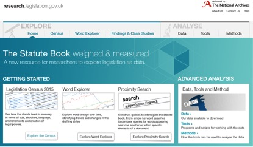

#Big Data for Law#

Imagine you are an historian or linguist tracing the use of particular words in legislation over time, or a legal researcher exploring the effectiveness of different styles of drafting. Searching traditional legal databases will find a particular law, but is not designed to enable research across the entire statute book.
Low cost cloud computing and big data approaches make it possible to research legislation as a whole system. What was missing are the data, tools and methods to interrogate a large corpus of legislation documents.

The _Big Data for Law_ project enabled The National Archives to address this. Starting with the government’s legislation database we explored researchers’ needs. Were researchers equipped to make good use of big data technologies and confident about data analysis, statistical methods and using technical tools to interrogate data? Surveys and interviews discovered a huge appetite and ambition to carry out research across the statute book, but a lack of confidence and skills. Providing data, even with tools and descriptions about how to use it, was not going to be enough. We needed to support researchers to carry out original research without requiring sophisticated programming skills in the niche technologies best suited to legislation data. 

We developed simple tools for querying legislation data, targeting Excel as the application most likely to be used for data analysis. A ‘words explorer’ allows researchers to query the large n-grams dataset we created by entering the word or sequence of words they are interested in. The tool generates a graph that counts and plots usage over time, providing underlying data as a CSV file, for loading into Excel or other data analysis packages. Researchers can find the individual pieces of legislation those words have occurred in, with counts by item. For example, the phrase ‘to or in respect of’ is often used in pensions legislation as shorthand for the requirement that money should be paid directly to a person on their behalf. Identifying when this is used, how often and usage trends provides deep insights into changing styles of legislative drafting. Researchers can also search within the n-grams data, returning all of the larger word phrases that a particular word or phrase has been used in. These powerful tools provide a capability to understand legislation in a way that simply wasn’t possible before. 

For more complex questions, researchers can use a ‘query builder’ tool – a simplified query language for the statute book, designed specifically for legislation. Users can search for words or phrases that are in close proximity, for example in the same subsection, provision or Part. Before the tool was developed, building complex queries like this would have required in depth knowledge of X-Query and the Crown Legislation Markup Language. Now you just need curiosity. Within seconds, for example, researchers can find all legislation originating from a specific government department, all legislation made under a particular power or all legislation that implements EU legislation. If you are interested finding legislation made under the European Communities Act 1972 where there was also a requirement for consultation, that’s possible too. The tool allows sophisticated querying across the entire statute book and is capable of returning textual results or counts of instances. It makes the statute book readily measurable in a way it wasn’t possible to do before. 

These tools are revolutionary. They help researchers to understand how the statute book works as a system, without requiring them to work with complex raw data or learn niche programming languages. The knowledge and insights these tools make possible have the potential to transform how legislation is envisaged, drafted, published and understood by the reader.

Research team: John Sheridan, The National Archives; Helen Xanthaki, Institute of Advanced Legal Studies, University of London; David Howarth, University of Cambridge

_Image: Screenshot from the Big Data for Law website: research.legislation.gov.uk_

[back](./)