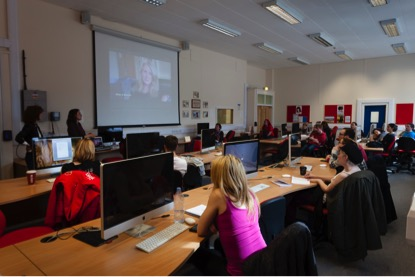

#Deep Film Access#

Film production is an information and knowledge-intensive industrial process which is undergoing dramatic changes in response to evolving digital technology. The _DEEP FILM Access project_ (DFAP) researched the potential role of semantic technology in film production, focusing on how a semantic infrastructure could contribute to the integration of the data and metadata generated during the film production lifecycle. DFAP initiated a preliminary development of a knowledge framework to support the automatic management of feature film digital assets.   The project employed an initial workflow analysis which then developed into a semantically rich hybrid ontological framework.

DFAP was undertaken in collaboration with film production practitioners and archive curation specialists, aiming to support a new framework of standards for recording and linking data during the production of feature films. Project partners included the BBC, the BFI, Screen Archive South East, and Adventure Pictures, and the project worked with director Sally Potter’s 2012 film *Ginger & Rosa*. By working with the entire corpus of materials generated by the film’s production, DFAP addressed the complexity of relationships and interconnections between a diversity of data types, from scripts and emails between directors and producers, to budget information, shooting schedules, digital film and sound files, and Polaroid photographs taken for continuity. 

The project initially involved the collation of the entire *Ginger & Rosa* dataset from the formation of the script idea through to distribution. This piece outlines one of the key challenges of this project’s endeavour, as well as one of the highlights of being able to work with such a visually rich resource.

The data set was highly complex in nature. All data, files and materials that were generated were implicitly interlinked, but with connections both unrecorded and lost throughout the production process. During the making of any independent or commercial feature film, the dominant imperative of all those involved, is to move efficiently through the film production workflow, on schedule and on budget. As such, files are changed, over-written and deleted as part of the efficiency methods employed throughout the process in order to facilitate smooth data-flow and to keep processes running smoothly on set. This implicit data-loss is compounded by the fact that there is generally no established archival strategy factored into the film production process - materials become quickly separated across geographic and physical locations, dispersed across hard drives and servers, making the collation of the data at the end of the production fraught with challenges, despite starting this process shortly after the completion of *Ginger & Rosa*.

These two factors – complexity and lack of an archival system - made it an exceptionally challenging task to bring together the data set in its entirety in order to begin the modeling and ontological design. It involved the recreation of many production documents and files by the film’s production team in order to resolve any gaps and discrepancies in the workflow. Despite these challenges, the value of this work was made abundantly clear during a public-facing workshop at the 2014 Bradford International Film Festival. The workshop entitled ‘The Anatomy of a Film: Professional Filmmaking practice and process’ ran in conjunction with the Sally Potter Retrospective, enabled participants to interact and engage with different aspects of the dataset including planning documentation, art department materials and video and sound rushes.  This allowed the participants to gain a deeper understanding of the film production workflow, as well as contributing ideas as to how these materials could be accessed in the future through new methods of digital archiving which the DFAP ontology is designed to support.

Research team: University of Brighton: Sarah Atkinson; Roger Evans; Jos Lehmann

_Image: Deep Film Access project workshop_
