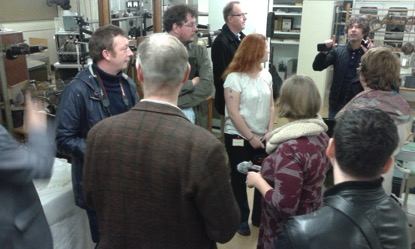
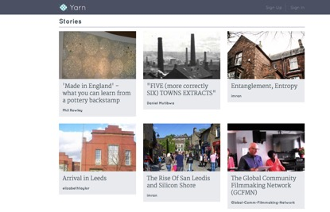

## Pararchive: Open Access Community Storytelling and the Digital Archive

The Pararchive project worked with a diverse range of communities to design and build a digital platform that would allow them to tell stories, present their own histories, research and work collaboratively. We aimed to provide resources that could enable communities to develop expertise and resilience.  To become expert in the telling of their own stories, in communicating their own histories, and sharing knowledge. Resilient in developing confidence, growing new communities of interest and affinity, and sharing expertise.  Our groups, archaeologists and local historians from the Isle of Bute in Scotland, filmmakers and Arduino programmers from Manchester, and industrial historians, ceramics collectors and ecologists from Stoke- on-Trent, worked in partnership with technology developers to build the resource. They christened it YARN, a recognition of its focus on storytelling and the rich tapestry of narrative threads it generates. 

One of the most memorable experiences was working with communities to discover what they were passionate about and what they wanted to explore through their own storytelling. This passion and expertise was infectious and as the project progressed communities developed new relationships, identifying common interests, and began working together and sharing knowledge and resources.  For example, the famous Victorian toilets on the quayside at Rothesay on Bute were manufactured in Stoke-on Trent and an exchange soon began between these two distant communities about their history and shared heritage. The enriching of knowledge through collaboration was something everyone recognised and we all became increasingly concerned with how this could be expanded through developing links with large national institutions, and how we could break down some of the barriers between the public and private, liberating content and sharing expertise. We were particularly interested in issues around ownership, copyright and what mutual gains could be made in terms of expertise and community knowledge. 

We had already decided to work with BBC Archives and the Science Museum Group to explore how they could make material more available to communities and how they might develop new relationships with their audiences through collaborative working.  This process was driven by the communities themselves, and they began to identify material that was of value to them and related to their own histories and interests. All our partners were interested in the BBC’s holdings and we were able to provide access to programmes that could support their research. This was a virtual exploration of the archive and digitally facilitated. Given the geographic spread of communities this was straightforward and inclusive. What was much more problematic, and frustrating, was the barrier that existed between people and non-digital materials − objects and images − in a physical archival space. Collections, such as those owned by the Science Museum, were extremely attractive to communities but they felt remote and disadvantaged. One initiative, which has now grown into a follow-on research project of its own, saw us taking community volunteers from Stoke-on-Trent into the Science Museum archive to explore and select from one of the most valuable scientific collections in the world relating to their interest in ceramics. During this intensive weekend our partners were given behind-the-scenes access to Blythe House, the Science Museum’s object store, and encouraged to access and explore more than 170,000 artefacts not on public display.  Working with curators they photographed objects of interest and we are now building a 3D visualisation of the archive and developing hyperlinks to allow for greater access and ownership of public collections. This small example exemplifies the value of public institutional collaboration, and is emblematic of the project and its future potential to bring communities and institutions together in mutually reinforcing relationships as we seek to take it to the next phase.

Read about the project and our community partners here: *http://pararchive.com* and become part of the YARN community here: *http://yarncommunity.com*

Research team: University of Leeds: Simon Popple; Stephen Coleman; Helen Graham; Daniel Mutibwa; Fiona Philip; Andy Turner; University of York: Jenna Ng; Community Partners: Danny Callaghan, The Potteries Tile Trail and Ceramic City Stories, Stoke-on-Trent;  Paul Duffy, Brandanii Archaeology and Heritage, Bute; Rachael Turner, Manchester Digital Laboratory; Science Museum: Tim Boon; Alison Hess; BBC Archives: Tony Ageh; Jake Berger; Carbon Imagineering: Imran Ali; Tom Morgan; Dean Vipond.

_Image1: Pararchive community visit to the Science Museum store at Blythe House_

_Image2: The Yarn community resource developed by the Pararchive project_

[back](./)